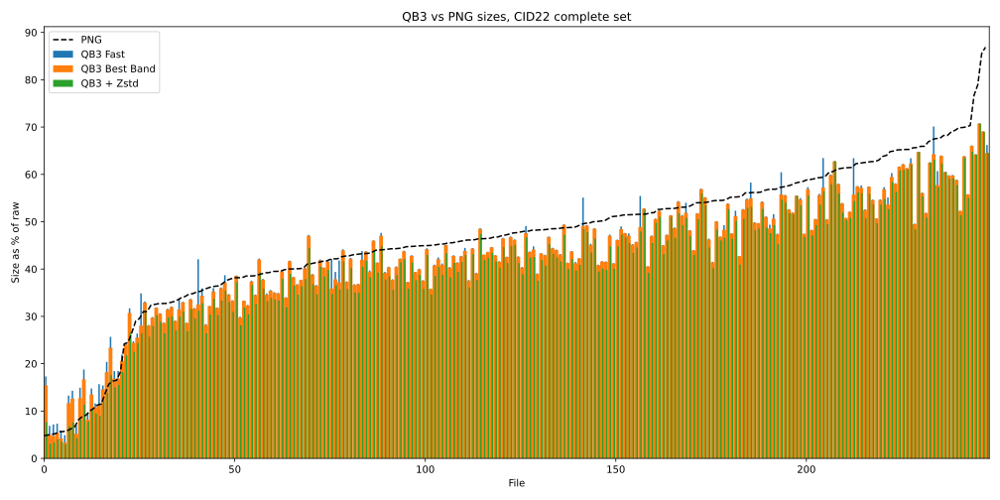

# QB3: Image/Raster Compression, Fast and Efficient 

- Better compression than PNG in most cases
- Lossless compression and decompression rate of 500MB/sec for byte data, 4GB/sec for 64 bit data
- All integer types, signed and unsigned, 8 to 64bit per value
- Lossless, or lossy by division with a small integer (quanta)
- No significant memory footprint during encoding or decoding
- No external dependencies, very low complexity

# Performance
Compared with PNG on a public image dataset, QB3 is 
[7% smaller while being 40 times faster](performance/performance.md)

# Library
The library, located in [QB3lib](QB3lib) provides a C API for the QB3 codec.
Implemented in C++, can be built on most platforms using cmake.
It requires a little endian, two's complement architecture with 8, 16, 32 
and 64 bit integers, which includes AMD64 and ARM64 platforms, as well as WASM.
Only 64bit builds should be used since this implementation uses 64 bit integers heavily.

# Using QB3
The included [cqb3](doc/cqb3.md) command line image conversion program converts PNG 
or JPEG images to QB3, for 8 and 16 bit images. It can also decode QB3 to PNG.
The source code serves as an example of using the library.
This optional utility does depend on an external library to read and write 
JPEG and PNG images.

Another option is to build [GDAL](https://github.com/OSGeo/GDAL) with
QB3 in MRF enabled.

[Web decoder demo](https://lucianpls.github.io/QB3/). A leaflet based browser 
of a Landsat scene containing 8 bands of 16bit integer data. The QB3 tiles contain
all 8 bands, they are decoded in the browser using the WASM decoder every 
time the screen needs to be refreshed.
In QB3 format, this Landsat scene is half the size of the equivalent COG (TIFF) 
which uses LZW compression.

# C API
[QB3.h](QB3lib/QB3.h) contains the public C API interface.
The workflow is to create opaque encoder or decoder control structures, 
set or query options and encode or decode the raster data.  
There are a few QB3 encoding modes. The default mode (QB3M_FTL) is the fastest. 
The QB3M_FTL mode is 25% faster than QB3M_BASE, while being less than .1% worse 
in compression ration. The QB3M_BEST is better but even slower, about half the 
speed of QB3M_BASE, it can sometimes result in significant compression ratio gains.
For 8bit natural images the size differences between the three modes is usually 
very small.
It is frequently possible to further compress the QB3 output using a generic 
lossless compression such as ZSTD at a very low effort setting (zip the QB3 output).
This second pass is especially advisable for images which contain repeated 
sequences.

# Code Organization
The core QB3 compression is implemented in qb3decode.h and qb3encode.h 
as C++ templates.  
The higher level C API and the binary format serialization and deserialization
is located in qb3encode.cpp and qb3decode.cpp. Lossy compression by 
pre-quantization of input values is also implemented in these files.

## Version 2.0.0
Version 2.0.0 is an update to the QB3 codec that breaks backward compatibility
with version 1.x. The API and all the previous features stay the 
same, but the binary format is different. Version 1.x is deprecated and should
not be used anymore.
The main changes are:

- Improved compression ratio by tuning the 8 bit encoding tables to match the 
expected bit rank distribution of natural images. This change results in a 
slightly smaller output for all modes, especially for 8 bit images, and it 
comes with no speed penalty.
- Encoding of images less than 4 pixels wide or less than 4 pixels tall is 
now possible. Images with a total of sixteen or fewer pixels are simply stored, 
while narrow or short images are encoded after reordering the pixel values 
while preserving the locality as much as possible.
- cqb3 conversion program can convert all PNG files found in a folder.

## [Change Log](doc/changelog.md)

## License

This code is licensed under the Apache License Version 2.0. See [LICENSE](LICENSE) for details.
