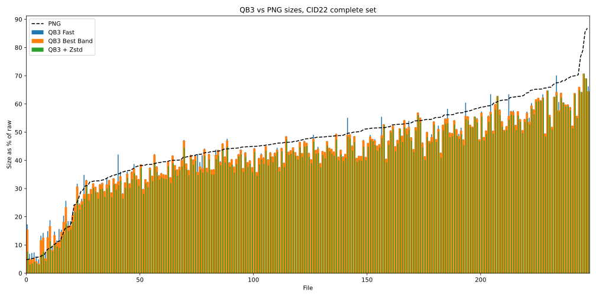

# QB3: Image/Raster Compression, Fast and Efficient

- Compression and decompression rates above 600MB/sec for byte data
- Better compression than PNG
- All integer types, up to 256 bands
- Lossless, or lossy by division with a small integer (quanta)
- No significant memory footprint during encoding or decoding
- No external dependencies, very low complexity

# Performance
Compared with PNG on a public image dataset, QB3 is 
[7% smaller while being 60 times faster](performance/performance.md)

# Library
The library, located in [QB3lib](QB3lib) provides a C API for the QB3 codec.
Implemented in C++, it can be built on most platforms using cmake.
It only requires a little endian two's complement architecture with 8, 16, 32 
and 64 bit integers, which includes AMD64 and ARM64 platforms, as well as WASM.
Only 64bit builds should be used since this implementation uses 64 bit integers heavily.

# Using QB3
The included [cqb3](doc/cqb3.md) command line image conversion program 
converts PNG or JPEG images to QB3, for 8 and 16 bit images, and also decodes 
QB3 to PNG. The source code for cqb3 serves as an example of using the library.
This optional utility does depend on an external library to read and write 
JPEG and PNG images.  
Another option is to build [GDAL](https://github.com/OSGeo/GDAL) with
QB3 in MRF enabled.

[Web decoder demo](https://lucianpls.github.io/QB3/). A leaflet based browser 
of a Landsat scene containing 8 bands of 16bit integer data. The QB3 tiles contain
all 8 bands, they are decoded in the browser using the WASM decoder every 
time the screen needs to be refreshed.
In QB3 format, this Landsat scene is half the size of the equivalent COG (TIFF) 
which uses LZW compression.

# C API
[QB3.h](QB3lib/QB3.h) contains the public C API interface.
The workflow is to create opaque encoder or decoder control structures, 
set or query options and encode or decode the raster data.  
There are a few QB3 encoding modes. The default mode (QB3M_FTL) is the fastest. 
QB3M_BASE mode is 25% slower, while compressing the data a tiny bit better. QB3M_BEST 
compresses better but even slower, about half the speed of QB3M_BASE. QB3M_BEST 
can sometimes result in significant compression ratio gains, depending on the data.
For 8bit natural images the size differences between the three modes is usually 
very small.
It is sometimes useful to further compress the QB3 output using a generic 
lossless compression such as ZSTD at a very low effort setting (zip the QB3 output).

# Code Organization
The core QB3 compression is implemented in qb3decode.h and qb3encode.h 
as C++ templates.  
The higher level C API and the binary format serialization and deserialization
code is located in qb3encode.cpp and qb3decode.cpp. Lossy compression by 
pre-quantization of input values is also in these files.

# Version 2.1.1
- 5 to 10% faster decompression on normal and best modes
- Fixed an out of bounds read

# [Full Change Log](doc/changeLog.md)

# License

This code is licensed under the Apache License Version 2.0. See [LICENSE](LICENSE) for details.
