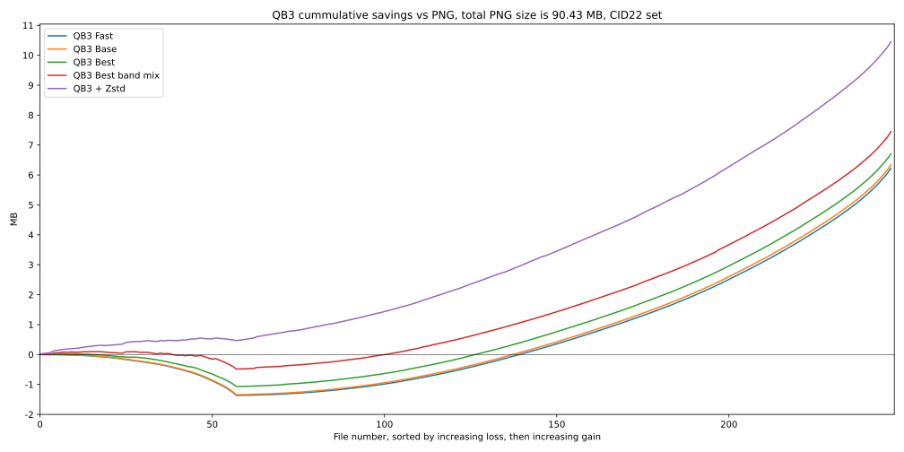
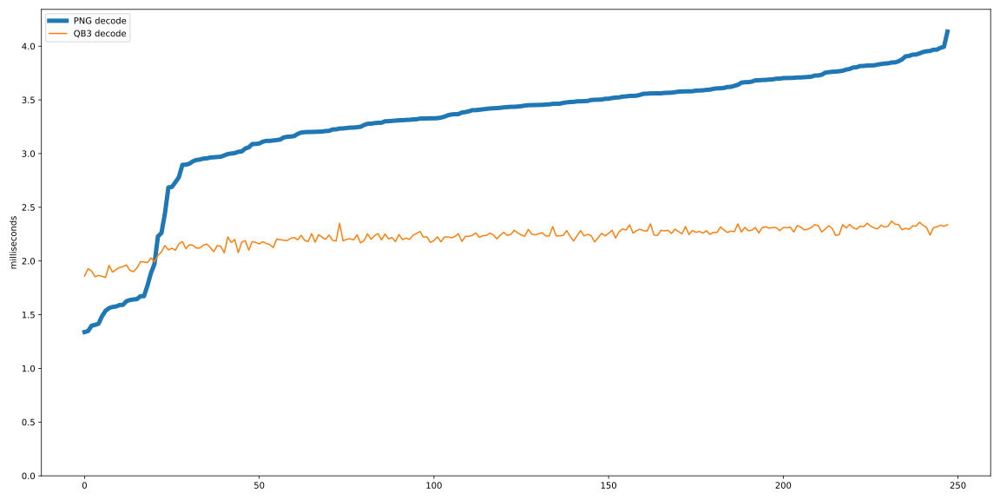

# QB3 Performance vs PNG

## Abstract

QB3 is a lossless image compression algorithm that is able to compress natural images very well, 
measurably better than PNG for most inputs while being forty times faster than PNG for 8 bit 
data. In addition to 8 bit data, QB3 also handles 16, 32 and 64 bit integer raster data, with 
multiple color bands. QB3 is portable, low complexity, single pass compression algorithm with 
no measurable memory overhead and no external dependencies, which makes it very easy to use.
The compression speed depends on the input, but less so than in other formats. It is able to 
compress and decompress a full HD 1080P sequence of frames at 60 frames per second while 
using a single thread of a modern CPU.

## Introduction

This document describes the performance of the QB3 image compression compared to the PNG, on the same hardware.
PNG (Portable Network Graphics) is a lossless image format that is widely used on the web. It is based on 
the DEFLATE compression algorithm, which is also used in the ZIP file format. The image specific part of the
PNG format is applying a filter to the image data before compressing it with DEFLATE. The filter is selected 
from a set of algorithms that try to predict the value of a pixel based on the values of the pixels 
seen before it, which tends to make the data more compressible. PNG can handle images with 8-bit and 16-bit 
unsigned values per channel image.
In comparison, QB3 is an integer lossless image compression that does not use any external libraries for 
entropy coding. It is also using a predictor filter to make the data more compressible, followed by a simple, 
fixed entropy coding scheme that does not adapt to the data. QB3 can handle all integer types from 8 to 64 bits.

## Method
This comparison is done on the reference images from the 
[Cloudinary Image Dataset ’22](https://cloudinary.com/labs/cid22) (CID22) dataset, shown below.  


The 512x512 8bit RGB reference images are used, with the two single band (grayscale) images being removed. 
The images are mostly natural photographs, plus a few illustrations and computer 
generated images. The input images are compressed using the cqb3 tool, using various QB3 settings available. 
Then the qb3 output images are converted back to PNG, also using the cqb3 conversion utility, which in turn 
relies on libpng 1.6.44 and zlib 1.3.1.1 at the default settings. The PNG images used in comparison are the 
restored PNGs, not the original ones.
The computer used has an AMD 5955W CPU with sufficient memory, running Windows 11. QB3 V1.3.2 compiled 
using Visual Studio 22 with the CLang-CL compiler was used. The timings used are the ones recorded by the 
cqb3 tool, which measures only the time spent for the compression itself, from raw image to compressed 
image, in memory. Finally, a Jupyter notebook was used to analyze the timings and the size of the image 
files and to plot various graphs.

## Results

### Compressed size
The following graph shows the size of the compressed images relative to the raw size, for the 
various QB3 settings. QB3 modes include FAST, BASE and BEST. In addition to the default R-G, G, B-G band filter, 
cqb3 can try all the possible RGB band combinations and pick the one that results in the smallest file. 
This option was applied in combination with the best mode, resulting in the smallest file size achievable 
with QB3 only. The compression in BEST plus band mix mode is better or equal to the BEST mode, which is better 
or equal to the BASE mode, which is better or equal to the FAST mode. 
It is possible to apply an external post processing step with DEFLATE or ZSTD to the QB3 compressed image, 
which frequently reduces the file size even further. This second step has a larger impact for synthetic, 
computer generated images, which benefit from the reduction of repeated sequences, which are not taken 
advantage of in the QB3 compression.


The images are sorted by the size of the PNG file, from the smallest to the largest, the dashed black line. The 
limits of the QB3 modes are the blue and the yellow lines, which are the FAST and BEST + Band mix modes. The green
lines are the best band mix sizes combined with ZSTD at the default level of 3.  
It is clear that QB3 is able to compress these images better than PNG even in the least compression (FAST) mode, 
with few exceptions. Especially significant is the large difference between the QB3 and PNG size for the 
largest images. The noticeable drop in size in the first 20 images or so are due to the fact that these images 
are computer generated, very suitable for the PNG compression which reaches compression ratios of 1:4 
or better. Yet even for these images QB3 is competitive. Adding the ZSTD post processing step improves the 
compression for these images more than it does for the photographs.

Another way of looking at the compression quality is to look at the aggregate size savings of the QB3 
compression vs PNG.



The savings are cumulative, for the 248 images, split in two groups. The first group, for images 0 to 
60, are the images where images compressed with QB3 FAST mode are larger than the corresponding PNG, 
resulting in negative savings. The second group are the rest of the images, where QB3 FAST is equal to 
or smaller than the corresponding PNG, thus the size savings are positive. Within each group, the 
images are sorted from the smallest absolute savings to the largest. In other words, the slope of the 
graph is steeper when the difference in size between the two compression methods is larger, 
either positive or negative, while the slope is almost flat where the difference is small. This order
makes it easier to see inflection point, or the ratio of image where QB3 is better than PNG. The other 
QB3 modes are plotted on the same scale, using the QB3 FAST image order. The conclusion here is that 
for the complete dataset all the QB3 modes are better than PNG, saving between 6 and 7 MB out of the 
90MB of PNG images. The difference between the QB3 modes is small, with the FAST and BASE 
mode being almost identical. The BEST + band mix brings a significant improvement, especially for 
the images where the FAST QB3 mode is larger than the PNG. Adding ZSTD increases the savings by an 
extra 4 MB, which is very significant.
In best mode, the total savings vs PNG are 7.42%, which is already very good for a lossless compression, 
and increasing to 11.56% with zstd post processing. This size of saving can be extremely significant 
for long term storage.

#### Aggregate savings vs PNG by QB3 compression mode
```
Total size of input PNGs: 90431161, 46.3666% of raw
QB3 fast: 6219876 6.88%
QB3 base: 6334365 7.0%
QB3 best: 6706606 7.42%
QB3 best + band mix: 7445604 8.23%
QB3 best + band mix + zstd: 10450694 11.56%
Total QB3 output: 88.44% of the PNGs
QB3 41.0082% of raw
```


### Compression speed

The next thing to look at is the compression speed, which is the main advantage of the QB3 format.


In this graph, the images are sorted by the compression time of the PNG, which tends to be roughly 
proportional to the PNG output size, the thicker brown line, varying between 14 and 150 milliseconds, 
with an average of 83 milliseconds.
There is a very clear, massive difference in compression speed between QB3 and PNG. The QB3 modes are the almost
flat lines at the bottom of the graph, taking between 1 and 5 milliseconds to compress a 512x512x3 8 bit image,
showing very little variation between images. The slowest mode of the QB3 for the slowest to compress image 
is less than half of the fastest PNG compression time.
The QB3 compression speed is 20-40 times faster than PNG for natural images. Even QB3 BEST + Band mix, which 
compresses the input image 9 times in sequence, is still faster than the PNG compression in most cases. 
This is the red line on the graph above, which is the only one that is even intersecting the PNG line.
Note the compression rate of QB3, measured based on the raw data volume, which for the FAST mode averages 375 MB/s, 
with a peak of 884 MB/s! The PNG average compression rate is 9.47 MB/s, which is almost 40 times slower than 
the QB3 FAST mode. The difference is even larger at the extreme, for the slowest image to compress, the QB3 FAST 
mode is more than 55 times faster than PNG.
Within QB3 modes, the FAST mode is 10 to 20 % faster than the BASE mode, which is twice as fast as the QB3 BEST.
Raw data rate for HD video (1920x1080), 8 bit 60 FPS is 356MB/s, which is under the average compression rate for QB3 
FAST mode during this test, single thread, on a 4.5 GHz Zen 3 CPU, without CPU pinning. This means that it is 
possible to losslessly compress HD video at 60 frames per second in real time using QB3 using a single thread 
on a modern CPU.
Summarizing the results in just a few numbers:

|Time (ms)|FAST|BASE|BEST|PNG|
|---|---|---|---|---|
|Max|2.69|2.99|6.92|150|
|Avg|2.10|2.32|5.20|83.04|
|Min|0.91|0.99|1.44|12|


|Rate (MB/s)|FAST|BASE|BEST|PNG|
|---|---|---|---|---|
|Max|868.22|790.94|546.59||
|Avg|375.06|338.45|151.21|9.47|
|Min|292.32|263.04|113.63||


### Decompression speed
PND decompression is much faster than PNG compression, one of reasons for its popularity. 
QB3 consistently decompressed faster than PNG, although the difference is much less than the compression
speed difference. The decompression speed of QB3 is also very consistent, much more so than the PNG 
decompression.



|Rate (MB/s)|QB3|PNG|
|---|---|---|
|Max|447.96|591.12|
|Avg|352.79|238.80|
|Min|317.55|182.63|

In contrast to most compression algorithms, QB3 speed is almost symmetrical, with the decompression 
being slightly slower than the compression, except in the BEST mode, where compression is slower. 
This is due to the longer dependency chain during decompression, and also because it is harder for 
the compiler to vectorize. The decompression speed values presented here are for the QB3 FAST mode.
Decompression speed for QB3 BASE or BEST mode is about 20% slower, and more dependent on the data.

## 16 bit images

There are very few 16bit image datasets available for use on the internet. The image set available from 
[https://imagecompression.info/test_images/](https://imagecompression.info/test_images/) is one 
such set. The set consists of 14 images of varying sizes available in both 8 and 16 bit versions, 
selected for being difficult to compress. When compressing the 8 bit images, on the average QB3 is 
almost the same as PNG as far as compression ratio goes, only the BEST mode with band mix results
in space savings. The results are much better for the 16 bit linear images, where QB3 saves 9 to 
10% smaller than PNG overall, an amazing result for lossless compression.
It should be mentioned that overall, PNG only compresses this dataset by about 20% compared with raw, 
while QB3 reaches 30%. Obviously, the *hard to compress* description of the dataset is true.
The better behavior of QB3 for 16 bit data is expected, QB3 is fully data type aware while PNG is only 
partially so. As far as the compression speed, QB3 FAST mode averages 280MB/s while PNG is 
around 15.5MB/s, making QB3 FAST 18 times faster than PNG. PNG in this case is somewhat favored, since
the data doesn't compress much at all with the DEFLATE algorithm, which makes it considerably faster 
than usual. At the same time, the QB3 rate is penalized a little by the larger output data size generated, 
at least relative to the 8 bit CID22 test case.
Adding ZSTD doesn't seem to help much in this case, improving compression by less than 0.2%.
Out of the images in the dataset, the one named *artificial.png* is the one that penalizes QB3 the most,
as it is a synthetic image with a lot of repeated patterns. *fireworks.png* is also a difficult image,
being noisy and high contrast, yet using R-G, G, B color mix helps keeping QB3 competitive.

## More about PNG and QB3

QB3 is not a full replacement for PNG. One of the important features of PNG is stability, it has been
around for more than 30 years without breaking compatibility, likely a reason for its popularity. The 
standard libPNG has many features that are not intrinsic to the PNG format, but make the library more useful. 
There are many PNG features that QB3 lacks and vice versa. This study is just a simple comparison of the 
performance on a particular set of 8 bit RGB images, which both formats can handle, to show the potential 
of QB3.  
It should be relatively easy to improve PNG compression, for example by adding the band decorrelation 
step that QB3 uses. Or by replacing the DEFLATE entropy coding with ZSTD, which is considerably faster 
than DEFLATE and can achieve better compression ratios. It would be a different kind of PNG at that point, 
not backwards compatible, which is a big negative.
Similarly, the improved compression from the second pass ZSTD shows that QB3 compression could be improved 
by replacing or enhancing the entropy coding with a more sophisticated one. 
Further, it should be possible to have QB3 added to PNG as an additional compression method. Since it's 
so fast, it could be done in addition to the existing PNG compression, and have the encoder pick the best 
one, without increasing the compression time much. Since DEFLATE is already part of PNG, it could be used 
as the second pass entropy encoding for QB3, making it even better. Of course this would not be fully 
backwards compatible, but it could be done while keeping the PNG API unchanged, so at least some 
applications would only need to be recompiled to take advantage of the new compression method.

## Footnotes

Two grayscale images from the CID22 have been removed from the comparison. Keeping them would have made 
the results harder to explain, because the QB3 band decorrelation doesn't apply to single band images. 
The raw sizes and the time taken on these would have been significant outliers, such as being 9 times 
faster on the band mix, since there is no RGB band mix to try.
The overall compression results would have been very similar even with those images included, one of 
the images compresses better with QB3 than PNG, while the other worse, as single band grayscale. 
Promoting these images to RGB by duplicating the grayscale would have favored QB3, since 
the band decorrelation in QB3 would make these three band grayscale images compress much better than PNG.

There are other lossless image formats or lossless variants of other formats, such as WebP and JpegXL. In 
comparison to these, QB3 is not heavily optimized for compression ratio. Yet QB3 in general compresses 
better than PNG, which is the most widely used lossless image format. The formats that obtain better compression 
ratios than QB3 are usually slower and more complex. They also frequently have large memory requirements 
and use multiple threads in parallel to achieve reasonable compression speeds.
This comparison is not exhaustive, but it is representative of the performance of QB3 in general.
There are alternative PNG compression implementations, which could be faster or better than the 
reference libPNG used here. Even the standard libPNG has settings that can be adjusted to increase 
compression at the expense of speed or vice versa. It is not within the scope of this study to 
exhaustively explore the PNG capabilities, the default PNG settings are a chosen to produce a reasonable 
compression in a reasonable amount of time.  
QB3 relies only on the locality of the image data for compression and does not have a long term context. This is 
fine for natural images, but for computer generated, synthetic images, QB3 might lag in compression ratio when 
compared to PNG, needing a post processing step with a contextual entropy encoder such as DEFLATE or ZSTD to 
achieve competitive results. This is only an issue for images that are highly compressible to start with, which 
are not a significant issue in general. The ZSTD or DEFLATE should be done at a very low effort level, which is
still very fast and produces most of the size reduction. Applying a higher effort level entropy coding does 
not increase the savings over the lower effort in most cases.

At the other extreme, like any lossless compression, QB3 compression is poor for noisy, high contrast images. 
In some cases QB ends up expanding the data, and then reverting to storing the raw input as is.
There are also other image datasets, many of which have different characteristics than the CID22 dataset used here.
For example the Kodak image set, which is a set of 24 natural images, slightly larger than the CID22 images. 
QB3 compresses better than PNG for each and every image in the Kodak set. Another image 
dataset is available from [https://imagecompression.info/test_images/](https://imagecompression.info/test_images/). 
This set is smaller, consisting of images of various sizes, selected to be hard to compress. QB3 
is about the same as PNG on this set overall, with the expected problems with artificial and 
noisy images. This set also contains 16 bit images, where QB3 is able to compress significantly 
better than PNG.
