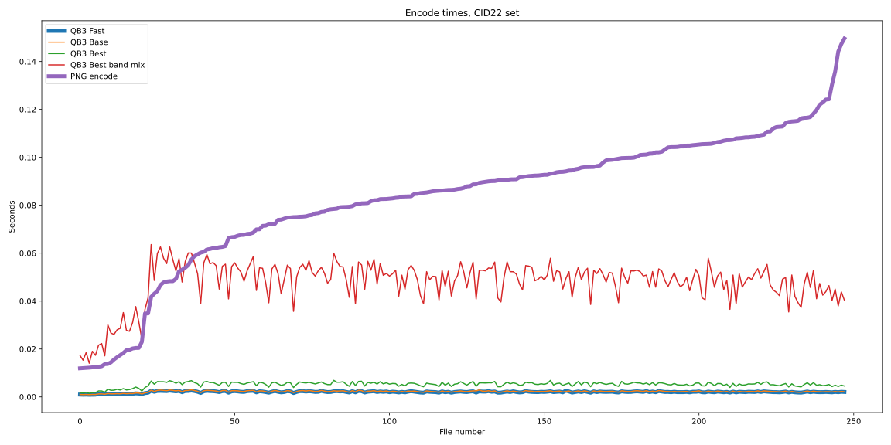

# QB3 Performance vs PNG

## Introduction

This document describes the performance of the QB3 system compared to the PNG system, on the same hardware.
PNG (Portable Network Graphics) is a lossless image format that is widely used on the web. It is based on 
the DEFLATE compression algorithm, which is also used in the ZIP file format. The image specific part of the
PNG format is applying a filter to the image data before compressing it with DEFLATE. The filter is a set of
simple predictive algorithms that tries to predict the value of a pixel based on the values of the pixels 
around it, which tends to make the data more compressible. PNG can handl 8-bit and 16-bit per channel images.  
In comparison, QB3 is an integer lossless image compression that does not use any external libraries for 
entropyy coding. It is also using a predictor filter to make the data more compressible, followed by a simple, 
fixed entropy coding scheme that does not adapt to the data. QB3 can handle all integer types from 8 to 64 bits.

## Method
The comparison is done on the 248 RGB 8 bit reference images from the 
[Cloudinary Image Dataset ’22](https://cloudinary.com/labs/cid22) (CID22) dataset. The images used are the 
reference 512x512 8bit RGB pixels, with the two single band images being removed from the dataset. The images
are mostly photographs, with a few illustrations and computer generated images.
The input images have been compressed using the cqb3 tool, using various settings available. Then the qb3 
output images were converted back to PNG, also using the cqb3 tool which in turn uses libpng 1.6.44 and
zlib 1.3.1.1 with the default settings. The PNG images used in comparison are the restored PNGs, not the
original ones. The machine used is an AMD 5955W desktop with sufficient memory to hold the images in 
memory, in Windows 11. QB3 was compiled using Visual Studio 22 with CLang. The timings used are the ones
recorded by the cqb3 tool, which only measures the time spent for the compression itself, from raw image to 
compressed image, in memory. A Jupyter notebook was used to analyze the timings and the size of the image 
files and to plot various graphs.

## Results

### Compressed size
The following graph shows the size of the
compressed images in bytes, for the various QB3 settings. QB3 modes include FAST, BASE and BEST. In addition,
cqb3 can try all the possible RGB band mix combinations and picking the one that results in the smallest file, in
addition to the default R-G, G, B-G band mix. This was also applied in combination with the best mode, resulting
in the smallest file size achieavable with QB3 only. With QB3, the BEST plus band mix mode is better or equal 
to the BEST mode, which is better or equal to the BASE mode, which is better or equal to the FAST mode.
It is also possible to apply a post processing step with DEFLATE or ZSTD to the QB3 compressed image, step which 
may reduce the file size even further. In general this step reduces the compressed sized very little. It can be 
very useful for synthetic, computer generated images, which benefit from the reduction of repeated sequences, 
which are not taken advantage of in the QB3 compression.

First, a graph showing the size of the compressed images, in percentage of the raw size:


The images are sorted by the size of the PNG file, from the smallest to the largest, the dashed black line. The 
limits of the QB3 modes are the blue and the yellow lines, which are the Fast and Best + Band mix modes. The green
lines are the best band mix sizes combined with ZSTD at the default level of 3.  
It is clear that QB3 is able to compress these images better than PNG even in the least compression (FAST) mode, 
with few exceptions. Especially significant is the large differences between the QB3 and PNG for the largest images.
The difference in size is larger for the images that are less compressible, which are the 
larger images. The noticeable drop in size in the first 20 imags or so are due to the fact that these images 
are computer generated, which are very suitable for the PNG compression, achieving compression ratios of 1:4 
or better. Yet even for these images QB3 is competitive. Adding the ZSTD post processing step improves the 
compression significanly for these images, less so for the photographs.  

Another way of looking at the compression quality is to look at the agregate savings of the QB3 compression vs PNG.

The savings are cummulative, for the 248 input images, split in two groups. The first group, for images 0 to 60, are
the images where QB3 in FAST mode are larger than the corresponding PNG, resulting in negative savings. The second 
group are the rest of the images, where QB3 FAST is equal or smaller than the corresponding PNG, thus the size savings
is positive. Within each group, the images are sorted from the smallest absolute savings to the largest. In other 
words, the slope of the graph is the large when the difference in size is large between the two compression methods, 
either positive or netgative, and the slope is almost flat for images where the difference is small. This order
makes it easier to see inflection point, or the ratio of image where QB3 is better than PNG. The other QB3 modes are
plotted as well. The conclusion here is that for the complete dataset all the QB3 modes are better than PNG, saving
between 6 and 7 MB out of the 90MB of PNG images. The difference between the QB3 modes is small, with the FAST and BEST 
mode being almost identical. The BEST + band mix is significantly better, especially for the images where the FAST QB3
mode is larger than the PNG. Adding ZSTD post processing improves the savings by 4 MB, which is very significant.
In best mode, the savings vs PNG are 7.42%, which is very good for a lossless compression, increasing to 11.56% with 
zstd post processing. This kind of savvings can be extremely significant for long term storage.

#### Aggregate savings
```
Total size of input PNGs: 90431161, 46.3666% of raw
QB3 fast savings: 6219876 6.88%
QB3 base savings: 6334365 7.0%
QB3 best: 6706606 7.42%
QB3 best band mix savings: 7445604 8.23%
QB3 best band mix +zstd saving: 10450694 11.56%
Total QB3 output: 88.44% of the PNGs
QB3 41.0082% of raw
```


### Compression speed

The next thing to look at is the compression speed, which is really the main advantage of the QB3 format.

```
QB3 Fast:
 max 3.03ms,  259.39 MB/s
 avg 2.20ms, 357.52 MB/s
 min 0.96ms,  816.22 MB/s
QB3 Base:
 max 6.10ms,  129.00 MB/s
 avg 2.42ms, 324.39 MB/s
 min 1.01ms,  777.18 MB/s
QB3 Best:
 max 7.13ms,  110.36 MB/s
 avg 5.36ms, 146.72 MB/s
 min 1.46ms,  537.36 MB/s
QB3 Best Band:
 max 64.53ms,  12.19 MB/s
 avg 49.14ms, 16.00 MB/s
 min 13.89ms,  56.61 MB/s
PNG encode average: 84.13ms, 9.35 MB/s
```
Images are sorted by increasing compression time of the PNG, which is very similar to the PNG output size, the 
thicker brown line, varying between 14 and 150 milliseconds, with an average of 84 milliseconds.
There is a clear, massive difference in compression speed between QB3 and PNG. The QB3 modes are the almost
flat lines at the bottom of the graph, taking between 1 and 5 milliseconds to compress a 512x512x3 8 bit image,
showing very little variation between images. The QB3 compression speed is 20-30 times faster than PNG for natural images.
Even QB3 Best + Band mix, which compresses the input image 9 times, is still significantly faster than the PNG 
compression. This is the red line on the graph above, which is the only one that is even intersecting the PNG line.
Note the compression rate of QB3, measured based on the raw data volume, which for the FAST mode averages 357 MB/s, 
with a peak of 816 MB/s! The PNG average compression rate is 9.35 MB/s, which is 38 times slower than the QB3 FAST mode!
Within QB3, the FAST mode is 10 to 20 % faster than the BASE mode, which is twice as fast as the QB3 BEST.
Raw data rate for HD video (1920x1080), 8 bit 60 FPS is 356MB/s, which is the average compression rate of the QB3 
FAST mode during this test, single thread, on a 4.5 GHz Zen 3 CPU, without CPU pinning. This means that it is 
possible to losslessly compress HD video in real time using QB3 using a single thread on a modern CPU.

### Decompression speed
There is no graph for the decompression speed since QB3 is only about twice as fast as PNG, less significant 
than the compression speed difference. QB3 speed is almost symetrical, with the decompression speed being slightly 
slower than the compression speed, especially for the FAST mode. This is due to the fact that decompression has 
a longer dependency chain than compression, and it is also harder for the compiler to vectorize. The decompression 
speed is roughly the same for all QB3 modes, with the FAST mode being slightly faster than the BASE or BEST.

### Conclusion

QB3 is an extremely fast lossless image compression algorithm that is able to compress natural RGB images very well,
measurably better than PNG for most inputs and is almost fourty times faster than PNG for 8 bit data. In addition 
to 8 bit data, QB3 also handles 16, 32 and 64 bit integer raster data, with multiple color bands. QB3 is very 
suitable for high bit depth images, which are increasingly used in many applications. QB3 is a portable, low 
complexity, single pass compression algorithm with no measurable memory requirements and no external dependencies, 
which makes it very easy to use. The compression rate does depends very little on the input. It operates at 
roughly 10-15 clock ticks per input value for real images, being able to compress and decompress a full HD 
1080p@60fps sequence of frames in real time while using a single thread of a modern CPU.

### Other notes

There are other lossless image formats or lossless variants of oher formats, such as WebP and JpegXL. QB3 is 
not optimized for compression ratio, yet QB3 in general compresses better than PNG, which is the most widely 
used lossless image format. The formats that obtain better compression ratios than QB3 are usually known 
to be much more complex and slower, frequently having very large memory requirements and utilizing multiple 
threads to achieve reasonable compression speeds.
There are alternative PNG compression libraries, which can be faster or better than the libpng used here. 
There are also other image datasets, which may have different characteristics than the CID22 dataset used here.
QB3 relies only on the locality of the image data for compression, not having a long term context. This is 
great for natural images, but for computer generated, synthetic images, QB3 might lag in compression ratio when 
compared to PNG, needing a post processing step with a contextual entropy encoder such as DEFLATE or ZSTD to 
achieve competitive results. This is only an issue for images that are very compressible to start with, which 
are not a significant issue in general.
At the other extreme, QB3 is also sensitive to noisy, high contrast images, which can be very hard to compress.
